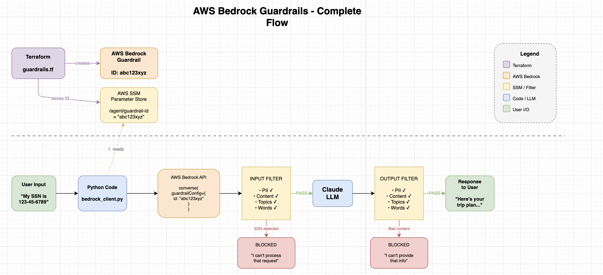

# Travel Planning Agent

A multi-agent travel planning system built with LangGraph and AWS Bedrock. Demonstrates the CoALA (Cognitive Architectures for Language Agents) memory architecture with all 4 memory types.

## CoALA Memory Architecture

This project implements all 4 types of memory from the CoALA framework:

| Memory Type | What It Stores | Implementation |
|-------------|----------------|----------------|
| **Working Memory** | Current conversation, trip details, flight/hotel options | `state.py` (TravelState class) |
| **Episodic Memory** | User's past trips, preferences, lessons learned | `user_profiles.py` + `user_profiles.json` |
| **Semantic Memory** | Facts about destinations, hotels, flights | `knowledge_base.py` + `data/mock_kb.json` |
| **Procedural Memory** | How agents should behave, output formats | `system_prompts/travel/*.txt` |


## Agent Flow

```
START -> trip_analyzer -> flight_searcher -> hotel_searcher -> itinerary_planner -> END
```

1. **trip_analyzer**: Asks questions, extracts destination/dates/budget
2. **flight_searcher**: Suggests flight options based on trip details
3. **hotel_searcher**: Suggests hotels matching budget and preferences
4. **itinerary_planner**: Creates day-by-day itinerary

## Setup

### 1. Install Dependencies

```bash
cd Travel-planning-agent
uv sync
```

### 2. Configure AWS

Make sure you have AWS credentials configured:

```bash
aws configure
```

Or set environment variables:

```bash
export AWS_ACCESS_KEY_ID=your_key
export AWS_SECRET_ACCESS_KEY=your_secret
export AWS_DEFAULT_REGION=us-east-1
```

### 3. Create .env File

```bash
# .env
AWS_REGION=us-east-1
CHECKPOINTER_MEMORY=sqlite
```

## Running the Agent

```bash
cd src
python3 main.py
```

### Example Conversation

```
You: I want to go to Tokyo

Agent: Great choice! Tokyo is an incredible destination. To help you plan:
       1. When are you thinking of visiting?
       2. How long do you want to stay?
       3. What's your total budget?
       4. How many people are traveling?
       5. What interests you most?

You: June 15 to June 22, budget $5000, 2 people, interested in food and temples

Agent: [Extracts trip details, searches flights, hotels, creates itinerary]
```

### Resume a Session

```bash
python3 main.py travel_abc123
```

### Save a Trip

Type `save` during conversation to save the trip to your profile. This enables personalized recommendations in future sessions.

## How Memory Works

### Working Memory (state.py)

Holds current session data:
- `travel_chat`: Conversation messages
- `trip_details`: Destination, dates, budget, travelers, interests
- `flight_options`: Found flights
- `hotel_options`: Found hotels
- `itinerary_draft`: Generated itinerary

### Episodic Memory (user_profiles.py)

Persists across sessions in `user_profiles.json`:
- Past trips with ratings
- User preferences (interests, budget range)
- Lessons learned

### Semantic Memory (knowledge_base.py)

Facts loaded from `data/mock_kb.json`:
- Destination info (attractions, climate, cuisine)
- Hotels (name, price, rating)
- Flights (routes, airlines, prices)
- Experiences (tours, activities)

### Procedural Memory (system_prompts/)

Text files that define agent behavior:
- What format to output (JSON)
- What questions to ask
- How to structure responses

## AWS Bedrock Model

Uses Claude Haiku 4.5 via the Converse API:

```python
# Model ID
us.anthropic.claude-haiku-4-5-20251001-v1:0
```


## Key Files Explained

| File | Purpose |
|------|---------|
| `main.py` | Runs the conversation loop, handles session management |
| `graph.py` | Connects agents with LangGraph, defines routing logic |
| `state.py` | Defines TravelState (what data agents share) |
| `memory.py` | SQLite checkpointer for session persistence |
| `knowledge_base.py` | Functions to search destination/hotel/flight facts |
| `user_profiles.py` | Functions to load/save user history |

## Evaluation Framework


### Metrics

| Metric | What It Measures | Threshold |
|--------|-----------------|-----------|
| **Correctness** | Key facts match expected output (GEval LLM-as-judge) | 0.7 |
| **Relevancy** | Response directly addresses the travel query | 0.7 |
| **Completeness** | Covers all aspects (dates, budget, transport, accommodation) | 0.7 |
| **Hallucination** | Detects fabricated flights, hotels, or facts | 0.5 |
| **Latency (p95)** | Response time under load | 30s |
| **Token Usage** | Input/output tokens per query | — |


### Running Evals Locally

```bash
# 1. Install dependencies
cd Travel-planning-agent
uv sync

# 2. Configure AWS credentials (needed for Bedrock judge model)
export AWS_ACCESS_KEY_ID=your_key
export AWS_SECRET_ACCESS_KEY=your_secret
export AWS_DEFAULT_REGION=us-east-1

# 3. Run evaluations
cd src
uv run eval.run_eval              # Trip analyzer (all 5 metrics)
uv run eval.run_eval_itinerary    # Itinerary planner eval
```

### Example Output

```
============================================================
  RESULTS
============================================================
  Correctness Avg:   0.850
  Relevancy Avg:     0.900
  Completeness Avg:  0.780
  Faithfulness Avg:  0.920
  Hallucination Avg: 0.150
  Pass Rate:         8/10
  Total Tokens:      12450
  Avg Latency:       3.2s
  Duration:          32.1s
  Saved to MLflow
============================================================
```

### MLflow Dashboard

```bash
cd eval
uv run mlflow ui --port 5000 --backend-store-uri sqlite:///mlflow.db
# Open http://localhost:5000 to view experiment runs, compare metrics across iterations
/workspaces/travel-planning-agent/eval/mlflow_run.png
```


#### Aws BedRock Guardrails Flow




